# System Architecture Diagrams

## 1. High-Level System Architecture

## 2. Microservices Architecture Detail

```mermaid
graph LR
    subgraph "Frontend Applications"
        WEBAPP[Web Application]
        MOBILEAPP[Mobile Application]
    end

    subgraph "API Gateway"
        KONG[Kong Gateway<br/>- Routing<br/>- Rate Limiting<br/>- Auth Validation<br/>- Request Logging]
    end

    subgraph "Service Mesh"
        AUTH_SVC[🔐 Auth Service<br/>Port: 3001<br/>- JWT Management<br/>- OAuth2<br/>- 2FA]
        
        USER_SVC[👤 User Service<br/>Port: 3002<br/>- Profile CRUD<br/>- Preferences<br/>- Avatar Management]
        
        EXPENSE_SVC[💰 Expense Service<br/>Port: 3003<br/>- Expense CRUD<br/>- Search & Filter<br/>- Audit Trail]
        
        CATEGORY_SVC[📁 Category Service<br/>Port: 3004<br/>- Category Management<br/>- Budgets<br/>- Icons/Colors]
        
        STORAGE_SVC[📦 Storage Service<br/>Port: 3005<br/>- File Upload<br/>- Image Processing<br/>- Signed URLs]
        
        ANALYTICS_SVC[📊 Analytics Service<br/>Port: 3006<br/>- Aggregations<br/>- Trends<br/>- Insights]
        
        REPORT_SVC[📄 Report Service<br/>Port: 3007<br/>- PDF Generation<br/>- CSV Export<br/>- Scheduled Reports]
        
        OCR_SVC[🔍 OCR Service<br/>Port: 3008<br/>- Image Processing<br/>- Text Extraction<br/>- Data Parsing]
        
        AI_SVC[🤖 AI Service<br/>Port: 3009<br/>- Categorization<br/>- Anomaly Detection<br/>- Chatbot]
        
        BUDGET_SVC[💵 Budget Service<br/>Port: 3010<br/>- Budget CRUD<br/>- Alerts<br/>- Tracking]
        
        NOTIF_SVC[🔔 Notification Service<br/>Port: 3011<br/>- Email<br/>- Push<br/>- SMS]
        
        INTEGRATION_SVC[🔗 Integration Service<br/>Port: 3012<br/>- Bank Sync<br/>- Payment APIs<br/>- Webhooks]
    end

    subgraph "Event Bus"
        KAFKA[Apache Kafka / RabbitMQ<br/>- Event Publishing<br/>- Event Consumption<br/>- Dead Letter Queue]
    end

    subgraph "Data Stores"
        PG_AUTH[(Auth DB)]
        PG_USER[(User DB)]
        PG_EXPENSE[(Expense DB)]
        PG_ANALYTICS[(Analytics DB)]
        REDIS_CACHE[(Redis Cache)]
        S3_STORAGE[(S3 Storage)]
        ELASTICSEARCH[(Elasticsearch)]
    end

    WEBAPP --> KONG
    MOBILEAPP --> KONG
    
    KONG --> AUTH_SVC
    KONG --> USER_SVC
    KONG --> EXPENSE_SVC
    KONG --> CATEGORY_SVC
    KONG --> STORAGE_SVC
    KONG --> ANALYTICS_SVC
    KONG --> REPORT_SVC
    KONG --> OCR_SVC
    KONG --> AI_SVC
    KONG --> BUDGET_SVC
    KONG --> NOTIF_SVC
    KONG --> INTEGRATION_SVC
    
    AUTH_SVC --> PG_AUTH
    AUTH_SVC --> REDIS_CACHE
    
    USER_SVC --> PG_USER
    USER_SVC --> REDIS_CACHE
    USER_SVC --> KAFKA
    
    EXPENSE_SVC --> PG_EXPENSE
    EXPENSE_SVC --> REDIS_CACHE
    EXPENSE_SVC --> ELASTICSEARCH
    EXPENSE_SVC --> KAFKA
    
    CATEGORY_SVC --> PG_EXPENSE
    CATEGORY_SVC --> REDIS_CACHE
    
    STORAGE_SVC --> S3_STORAGE
    STORAGE_SVC --> KAFKA
    
    ANALYTICS_SVC --> PG_ANALYTICS
    ANALYTICS_SVC --> REDIS_CACHE
    
    REPORT_SVC --> PG_EXPENSE
    REPORT_SVC --> S3_STORAGE
    REPORT_SVC --> KAFKA
    
    OCR_SVC --> S3_STORAGE
    OCR_SVC --> KAFKA
    
    AI_SVC --> PG_EXPENSE
    AI_SVC --> KAFKA
    
    BUDGET_SVC --> PG_EXPENSE
    BUDGET_SVC --> REDIS_CACHE
    BUDGET_SVC --> KAFKA
    
    NOTIF_SVC --> KAFKA
    
    INTEGRATION_SVC --> PG_EXPENSE
    INTEGRATION_SVC --> KAFKA
```

## 3. Service Communication Patterns

## 4. Data Flow Architecture

## 5. Deployment Architecture

## 6. Security Architecture

---

## Architecture Decision Records (ADRs)

### ADR-001: Microservices vs Monolith
**Decision:** Start with a modular monolith, extract services as needed  
**Rationale:** Easier to develop initially, can split later based on scaling needs  
**Consequences:** Single deployment initially, potential complexity when splitting

### ADR-002: Database Strategy
**Decision:** PostgreSQL as primary database with Redis for caching  
**Rationale:** Strong consistency, ACID compliance, excellent JSON support  
**Consequences:** Need to manage connection pooling, implement caching carefully

### ADR-003: Event-Driven Architecture
**Decision:** Use event-driven patterns for async operations  
**Rationale:** Decouples services, enables scalability, improves resilience  
**Consequences:** Need to handle eventual consistency, implement idempotency

### ADR-004: API Design
**Decision:** RESTful APIs with optional GraphQL endpoint  
**Rationale:** REST is well-understood, GraphQL for complex queries  
**Consequences:** Need to maintain both, but provides flexibility

### ADR-005: Authentication Strategy
**Decision:** JWT with refresh tokens + OAuth2  
**Rationale:** Stateless auth, industry standard, supports SSO  
**Consequences:** Token management complexity, need refresh token rotation

### ADR-006: File Storage
**Decision:** S3-compatible storage (AWS S3 or Cloudflare R2)  
**Rationale:** Scalable, cost-effective, CDN integration  
**Consequences:** External dependency, need signed URLs for security

### ADR-007: Caching Strategy
**Decision:** Multi-layer caching (Redis + CDN)  
**Rationale:** Reduces database load, improves response times  
**Consequences:** Cache invalidation complexity, potential stale data

### ADR-008: Testing Strategy
**Decision:** Comprehensive testing pyramid (unit > integration > e2e)  
**Rationale:** Catch bugs early, ensure code quality  
**Consequences:** Longer CI/CD times, test maintenance overhead

---

## Scalability Considerations

### Horizontal Scaling
- All services containerized and stateless
- Load balancing across multiple instances
- Auto-scaling based on metrics

### Database Scaling
- Read replicas for analytics queries
- Connection pooling (PgBouncer)
- Query optimization and indexing
- Partitioning for large tables (expenses by date)

### Caching Strategy
- Application-level caching (in-memory)
- Distributed caching (Redis)
- CDN caching for static assets
- Database query result caching

### Performance Targets
- API Response Time: < 500ms (p95)
- Page Load Time: < 2s
- Database Query Time: < 100ms
- Concurrent Users: 10,000+
- Throughput: 1000 req/s

---

## Disaster Recovery

### Backup Strategy
- Database: Daily full backups, hourly incremental
- File Storage: Multi-region replication
- Configuration: Version controlled
- Recovery Time Objective (RTO): < 4 hours
- Recovery Point Objective (RPO): < 1 hour

### High Availability
- Multi-region deployment
- Database replication
- Health checks and auto-recovery
- Circuit breakers for external services
- Graceful degradation

---

## Cost Optimization

### Infrastructure
- Use serverless where possible (reduce idle costs)
- Auto-scaling to match demand
- Spot instances for batch jobs
- Reserved instances for base load

### Storage
- Lifecycle policies (hot → warm → cold → archive)
- Compress images and files
- CDN for static assets

### Database
- Connection pooling
- Query optimization
- Archive old data
- Use read replicas wisely
