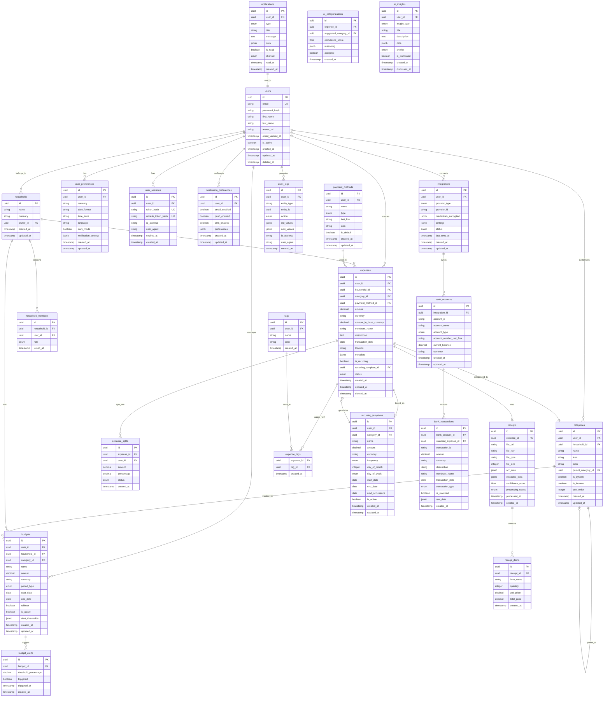

# Database Schema Design

## Entity Relationship Diagram



## Database Schema SQL

### Core Tables

```sql
-- Enable UUID extension
CREATE EXTENSION IF NOT EXISTS "uuid-ossp";
CREATE EXTENSION IF NOT EXISTS "pgcrypto";

-- Users Table
CREATE TABLE users (
    id UUID PRIMARY KEY DEFAULT uuid_generate_v4(),
    email VARCHAR(255) UNIQUE NOT NULL,
    password_hash VARCHAR(255),
    first_name VARCHAR(100),
    last_name VARCHAR(100),
    avatar_url TEXT,
    email_verified_at TIMESTAMP,
    is_active BOOLEAN DEFAULT true,
    created_at TIMESTAMP DEFAULT CURRENT_TIMESTAMP,
    updated_at TIMESTAMP DEFAULT CURRENT_TIMESTAMP,
    deleted_at TIMESTAMP
);

CREATE INDEX idx_users_email ON users(email);
CREATE INDEX idx_users_deleted_at ON users(deleted_at) WHERE deleted_at IS NULL;

-- User Sessions Table
CREATE TABLE user_sessions (
    id UUID PRIMARY KEY DEFAULT uuid_generate_v4(),
    user_id UUID NOT NULL REFERENCES users(id) ON DELETE CASCADE,
    token_hash VARCHAR(255) UNIQUE NOT NULL,
    refresh_token_hash VARCHAR(255) UNIQUE NOT NULL,
    ip_address INET,
    user_agent TEXT,
    expires_at TIMESTAMP NOT NULL,
    created_at TIMESTAMP DEFAULT CURRENT_TIMESTAMP
);

CREATE INDEX idx_sessions_user_id ON user_sessions(user_id);
CREATE INDEX idx_sessions_expires_at ON user_sessions(expires_at);
CREATE INDEX idx_sessions_token_hash ON user_sessions(token_hash);

-- User Preferences Table
CREATE TABLE user_preferences (
    id UUID PRIMARY KEY DEFAULT uuid_generate_v4(),
    user_id UUID UNIQUE NOT NULL REFERENCES users(id) ON DELETE CASCADE,
    currency VARCHAR(3) DEFAULT 'USD',
    date_format VARCHAR(20) DEFAULT 'MM/DD/YYYY',
    time_zone VARCHAR(50) DEFAULT 'UTC',
    language VARCHAR(10) DEFAULT 'en',
    dark_mode BOOLEAN DEFAULT false,
    notification_settings JSONB DEFAULT '{}',
    created_at TIMESTAMP DEFAULT CURRENT_TIMESTAMP,
    updated_at TIMESTAMP DEFAULT CURRENT_TIMESTAMP
);

-- Households Table
CREATE TABLE households (
    id UUID PRIMARY KEY DEFAULT uuid_generate_v4(),
    name VARCHAR(255) NOT NULL,
    currency VARCHAR(3) DEFAULT 'USD',
    owner_id UUID NOT NULL REFERENCES users(id) ON DELETE CASCADE,
    created_at TIMESTAMP DEFAULT CURRENT_TIMESTAMP,
    updated_at TIMESTAMP DEFAULT CURRENT_TIMESTAMP
);

CREATE INDEX idx_households_owner_id ON households(owner_id);

-- Household Members Table
CREATE TABLE household_members (
    id UUID PRIMARY KEY DEFAULT uuid_generate_v4(),
    household_id UUID NOT NULL REFERENCES households(id) ON DELETE CASCADE,
    user_id UUID NOT NULL REFERENCES users(id) ON DELETE CASCADE,
    role VARCHAR(20) NOT NULL CHECK (role IN ('owner', 'admin', 'member', 'viewer')),
    joined_at TIMESTAMP DEFAULT CURRENT_TIMESTAMP,
    UNIQUE(household_id, user_id)
);

CREATE INDEX idx_household_members_household_id ON household_members(household_id);
CREATE INDEX idx_household_members_user_id ON household_members(user_id);

-- Categories Table
CREATE TABLE categories (
    id UUID PRIMARY KEY DEFAULT uuid_generate_v4(),
    user_id UUID REFERENCES users(id) ON DELETE CASCADE,
    household_id UUID REFERENCES households(id) ON DELETE CASCADE,
    name VARCHAR(100) NOT NULL,
    icon VARCHAR(50),
    color VARCHAR(7),
    parent_category_id UUID REFERENCES categories(id) ON DELETE SET NULL,
    is_system BOOLEAN DEFAULT false,
    is_income BOOLEAN DEFAULT false,
    sort_order INTEGER DEFAULT 0,
    created_at TIMESTAMP DEFAULT CURRENT_TIMESTAMP,
    updated_at TIMESTAMP DEFAULT CURRENT_TIMESTAMP,
    CHECK (user_id IS NOT NULL OR household_id IS NOT NULL)
);

CREATE INDEX idx_categories_user_id ON categories(user_id);
CREATE INDEX idx_categories_household_id ON categories(household_id);
CREATE INDEX idx_categories_parent_id ON categories(parent_category_id);

-- Payment Methods Table
CREATE TABLE payment_methods (
    id UUID PRIMARY KEY DEFAULT uuid_generate_v4(),
    user_id UUID NOT NULL REFERENCES users(id) ON DELETE CASCADE,
    name VARCHAR(100) NOT NULL,
    type VARCHAR(20) NOT NULL CHECK (type IN ('credit_card', 'debit_card', 'cash', 'bank_transfer', 'digital_wallet', 'other')),
    last_four VARCHAR(4),
    icon VARCHAR(50),
    is_default BOOLEAN DEFAULT false,
    created_at TIMESTAMP DEFAULT CURRENT_TIMESTAMP,
    updated_at TIMESTAMP DEFAULT CURRENT_TIMESTAMP
);

CREATE INDEX idx_payment_methods_user_id ON payment_methods(user_id);

-- Recurring Templates Table
CREATE TABLE recurring_templates (
    id UUID PRIMARY KEY DEFAULT uuid_generate_v4(),
    user_id UUID NOT NULL REFERENCES users(id) ON DELETE CASCADE,
    category_id UUID REFERENCES categories(id) ON DELETE SET NULL,
    name VARCHAR(255) NOT NULL,
    amount DECIMAL(15, 2) NOT NULL,
    currency VARCHAR(3) DEFAULT 'USD',
    frequency VARCHAR(20) NOT NULL CHECK (frequency IN ('daily', 'weekly', 'biweekly', 'monthly', 'quarterly', 'yearly')),
    day_of_month INTEGER CHECK (day_of_month BETWEEN 1 AND 31),
    day_of_week INTEGER CHECK (day_of_week BETWEEN 0 AND 6),
    start_date DATE NOT NULL,
    end_date DATE,
    next_occurrence DATE,
    is_active BOOLEAN DEFAULT true,
    created_at TIMESTAMP DEFAULT CURRENT_TIMESTAMP,
    updated_at TIMESTAMP DEFAULT CURRENT_TIMESTAMP
);

CREATE INDEX idx_recurring_templates_user_id ON recurring_templates(user_id);
CREATE INDEX idx_recurring_templates_next_occurrence ON recurring_templates(next_occurrence) WHERE is_active = true;

-- Expenses Table (Main Table)
CREATE TABLE expenses (
    id UUID PRIMARY KEY DEFAULT uuid_generate_v4(),
    user_id UUID NOT NULL REFERENCES users(id) ON DELETE CASCADE,
    household_id UUID REFERENCES households(id) ON DELETE SET NULL,
    category_id UUID REFERENCES categories(id) ON DELETE SET NULL,
    payment_method_id UUID REFERENCES payment_methods(id) ON DELETE SET NULL,
    amount DECIMAL(15, 2) NOT NULL,
    currency VARCHAR(3) DEFAULT 'USD',
    amount_in_base_currency DECIMAL(15, 2),
    merchant_name VARCHAR(255),
    description TEXT,
    transaction_date DATE NOT NULL,
    location VARCHAR(255),
    metadata JSONB DEFAULT '{}',
    is_recurring BOOLEAN DEFAULT false,
    recurring_template_id UUID REFERENCES recurring_templates(id) ON DELETE SET NULL,
    status VARCHAR(20) DEFAULT 'completed' CHECK (status IN ('pending', 'completed', 'cancelled')),
    created_at TIMESTAMP DEFAULT CURRENT_TIMESTAMP,
    updated_at TIMESTAMP DEFAULT CURRENT_TIMESTAMP,
    deleted_at TIMESTAMP
);

CREATE INDEX idx_expenses_user_id ON expenses(user_id);
CREATE INDEX idx_expenses_household_id ON expenses(household_id);
CREATE INDEX idx_expenses_category_id ON expenses(category_id);
CREATE INDEX idx_expenses_transaction_date ON expenses(transaction_date);
CREATE INDEX idx_expenses_created_at ON expenses(created_at);
CREATE INDEX idx_expenses_deleted_at ON expenses(deleted_at) WHERE deleted_at IS NULL;
CREATE INDEX idx_expenses_merchant_name ON expenses(merchant_name);

-- Expense Splits Table
CREATE TABLE expense_splits (
    id UUID PRIMARY KEY DEFAULT uuid_generate_v4(),
    expense_id UUID NOT NULL REFERENCES expenses(id) ON DELETE CASCADE,
    user_id UUID NOT NULL REFERENCES users(id) ON DELETE CASCADE,
    amount DECIMAL(15, 2) NOT NULL,
    percentage DECIMAL(5, 2),
    status VARCHAR(20) DEFAULT 'pending' CHECK (status IN ('pending', 'paid', 'cancelled')),
    created_at TIMESTAMP DEFAULT CURRENT_TIMESTAMP
);

CREATE INDEX idx_expense_splits_expense_id ON expense_splits(expense_id);
CREATE INDEX idx_expense_splits_user_id ON expense_splits(user_id);

-- Receipts Table
CREATE TABLE receipts (
    id UUID PRIMARY KEY DEFAULT uuid_generate_v4(),
    expense_id UUID NOT NULL REFERENCES expenses(id) ON DELETE CASCADE,
    file_url TEXT NOT NULL,
    file_key VARCHAR(500) NOT NULL,
    file_type VARCHAR(50),
    file_size INTEGER,
    ocr_data JSONB,
    extracted_data JSONB,
    confidence_score FLOAT CHECK (confidence_score BETWEEN 0 AND 1),
    processing_status VARCHAR(20) DEFAULT 'pending' CHECK (processing_status IN ('pending', 'processing', 'completed', 'failed')),
    processed_at TIMESTAMP,
    created_at TIMESTAMP DEFAULT CURRENT_TIMESTAMP
);

CREATE INDEX idx_receipts_expense_id ON receipts(expense_id);
CREATE INDEX idx_receipts_processing_status ON receipts(processing_status);

-- Receipt Items Table
CREATE TABLE receipt_items (
    id UUID PRIMARY KEY DEFAULT uuid_generate_v4(),
    receipt_id UUID NOT NULL REFERENCES receipts(id) ON DELETE CASCADE,
    item_name VARCHAR(255),
    quantity INTEGER DEFAULT 1,
    unit_price DECIMAL(15, 2),
    total_price DECIMAL(15, 2),
    created_at TIMESTAMP DEFAULT CURRENT_TIMESTAMP
);

CREATE INDEX idx_receipt_items_receipt_id ON receipt_items(receipt_id);

-- Tags Table
CREATE TABLE tags (
    id UUID PRIMARY KEY DEFAULT uuid_generate_v4(),
    user_id UUID NOT NULL REFERENCES users(id) ON DELETE CASCADE,
    name VARCHAR(50) NOT NULL,
    color VARCHAR(7),
    created_at TIMESTAMP DEFAULT CURRENT_TIMESTAMP,
    UNIQUE(user_id, name)
);

CREATE INDEX idx_tags_user_id ON tags(user_id);

-- Expense Tags (Junction Table)
CREATE TABLE expense_tags (
    expense_id UUID NOT NULL REFERENCES expenses(id) ON DELETE CASCADE,
    tag_id UUID NOT NULL REFERENCES tags(id) ON DELETE CASCADE,
    created_at TIMESTAMP DEFAULT CURRENT_TIMESTAMP,
    PRIMARY KEY (expense_id, tag_id)
);

CREATE INDEX idx_expense_tags_expense_id ON expense_tags(expense_id);
CREATE INDEX idx_expense_tags_tag_id ON expense_tags(tag_id);

-- Budgets Table
CREATE TABLE budgets (
    id UUID PRIMARY KEY DEFAULT uuid_generate_v4(),
    user_id UUID NOT NULL REFERENCES users(id) ON DELETE CASCADE,
    household_id UUID REFERENCES households(id) ON DELETE CASCADE,
    category_id UUID REFERENCES categories(id) ON DELETE CASCADE,
    name VARCHAR(255) NOT NULL,
    amount DECIMAL(15, 2) NOT NULL,
    currency VARCHAR(3) DEFAULT 'USD',
    period_type VARCHAR(20) NOT NULL CHECK (period_type IN ('weekly', 'monthly', 'quarterly', 'yearly', 'custom')),
    start_date DATE NOT NULL,
    end_date DATE,
    rollover BOOLEAN DEFAULT false,
    is_active BOOLEAN DEFAULT true,
    alert_thresholds JSONB DEFAULT '{"warning": 80, "critical": 95}',
    created_at TIMESTAMP DEFAULT CURRENT_TIMESTAMP,
    updated_at TIMESTAMP DEFAULT CURRENT_TIMESTAMP
);

CREATE INDEX idx_budgets_user_id ON budgets(user_id);
CREATE INDEX idx_budgets_household_id ON budgets(household_id);
CREATE INDEX idx_budgets_category_id ON budgets(category_id);
CREATE INDEX idx_budgets_dates ON budgets(start_date, end_date);

-- Budget Alerts Table
CREATE TABLE budget_alerts (
    id UUID PRIMARY KEY DEFAULT uuid_generate_v4(),
    budget_id UUID NOT NULL REFERENCES budgets(id) ON DELETE CASCADE,
    threshold_percentage DECIMAL(5, 2) NOT NULL,
    triggered BOOLEAN DEFAULT false,
    triggered_at TIMESTAMP,
    created_at TIMESTAMP DEFAULT CURRENT_TIMESTAMP
);

CREATE INDEX idx_budget_alerts_budget_id ON budget_alerts(budget_id);

-- Integrations Table
CREATE TABLE integrations (
    id UUID PRIMARY KEY DEFAULT uuid_generate_v4(),
    user_id UUID NOT NULL REFERENCES users(id) ON DELETE CASCADE,
    provider_type VARCHAR(50) NOT NULL CHECK (provider_type IN ('plaid', 'stripe', 'paypal', 'quickbooks', 'calendar')),
    provider_id VARCHAR(255),
    credentials_encrypted JSONB,
    settings JSONB DEFAULT '{}',
    status VARCHAR(20) DEFAULT 'active' CHECK (status IN ('active', 'inactive', 'error')),
    last_sync_at TIMESTAMP,
    created_at TIMESTAMP DEFAULT CURRENT_TIMESTAMP,
    updated_at TIMESTAMP DEFAULT CURRENT_TIMESTAMP
);

CREATE INDEX idx_integrations_user_id ON integrations(user_id);
CREATE INDEX idx_integrations_provider_type ON integrations(provider_type);

-- Bank Accounts Table
CREATE TABLE bank_accounts (
    id UUID PRIMARY KEY DEFAULT uuid_generate_v4(),
    integration_id UUID NOT NULL REFERENCES integrations(id) ON DELETE CASCADE,
    account_id VARCHAR(255) NOT NULL,
    account_name VARCHAR(255),
    account_type VARCHAR(50) CHECK (account_type IN ('checking', 'savings', 'credit', 'investment')),
    account_number_last_four VARCHAR(4),
    current_balance DECIMAL(15, 2),
    currency VARCHAR(3) DEFAULT 'USD',
    created_at TIMESTAMP DEFAULT CURRENT_TIMESTAMP,
    updated_at TIMESTAMP DEFAULT CURRENT_TIMESTAMP,
    UNIQUE(integration_id, account_id)
);

CREATE INDEX idx_bank_accounts_integration_id ON bank_accounts(integration_id);

-- Bank Transactions Table
CREATE TABLE bank_transactions (
    id UUID PRIMARY KEY DEFAULT uuid_generate_v4(),
    bank_account_id UUID NOT NULL REFERENCES bank_accounts(id) ON DELETE CASCADE,
    matched_expense_id UUID REFERENCES expenses(id) ON DELETE SET NULL,
    transaction_id VARCHAR(255) NOT NULL,
    amount DECIMAL(15, 2) NOT NULL,
    currency VARCHAR(3) DEFAULT 'USD',
    description TEXT,
    merchant_name VARCHAR(255),
    transaction_date DATE NOT NULL,
    transaction_type VARCHAR(20) CHECK (transaction_type IN ('debit', 'credit')),
    is_matched BOOLEAN DEFAULT false,
    raw_data JSONB,
    created_at TIMESTAMP DEFAULT CURRENT_TIMESTAMP,
    UNIQUE(bank_account_id, transaction_id)
);

CREATE INDEX idx_bank_transactions_bank_account_id ON bank_transactions(bank_account_id);
CREATE INDEX idx_bank_transactions_matched_expense_id ON bank_transactions(matched_expense_id);
CREATE INDEX idx_bank_transactions_is_matched ON bank_transactions(is_matched);
CREATE INDEX idx_bank_transactions_transaction_date ON bank_transactions(transaction_date);

-- Notifications Table
CREATE TABLE notifications (
    id UUID PRIMARY KEY DEFAULT uuid_generate_v4(),
    user_id UUID NOT NULL REFERENCES users(id) ON DELETE CASCADE,
    type VARCHAR(50) NOT NULL CHECK (type IN ('budget_alert', 'expense_added', 'split_request', 'receipt_processed', 'insight', 'system')),
    title VARCHAR(255) NOT NULL,
    message TEXT,
    data JSONB,
    is_read BOOLEAN DEFAULT false,
    channel VARCHAR(20) CHECK (channel IN ('email', 'push', 'sms', 'in_app')),
    read_at TIMESTAMP,
    created_at TIMESTAMP DEFAULT CURRENT_TIMESTAMP
);

CREATE INDEX idx_notifications_user_id ON notifications(user_id);
CREATE INDEX idx_notifications_is_read ON notifications(is_read);
CREATE INDEX idx_notifications_created_at ON notifications(created_at);

-- Notification Preferences Table
CREATE TABLE notification_preferences (
    id UUID PRIMARY KEY DEFAULT uuid_generate_v4(),
    user_id UUID UNIQUE NOT NULL REFERENCES users(id) ON DELETE CASCADE,
    email_enabled BOOLEAN DEFAULT true,
    push_enabled BOOLEAN DEFAULT true,
    sms_enabled BOOLEAN DEFAULT false,
    preferences JSONB DEFAULT '{}',
    created_at TIMESTAMP DEFAULT CURRENT_TIMESTAMP,
    updated_at TIMESTAMP DEFAULT CURRENT_TIMESTAMP
);

-- Audit Logs Table
CREATE TABLE audit_logs (
    id UUID PRIMARY KEY DEFAULT uuid_generate_v4(),
    user_id UUID REFERENCES users(id) ON DELETE SET NULL,
    entity_type VARCHAR(50) NOT NULL,
    entity_id UUID NOT NULL,
    action VARCHAR(20) NOT NULL CHECK (action IN ('create', 'update', 'delete', 'view')),
    old_values JSONB,
    new_values JSONB,
    ip_address INET,
    user_agent TEXT,
    created_at TIMESTAMP DEFAULT CURRENT_TIMESTAMP
);

CREATE INDEX idx_audit_logs_user_id ON audit_logs(user_id);
CREATE INDEX idx_audit_logs_entity ON audit_logs(entity_type, entity_id);
CREATE INDEX idx_audit_logs_created_at ON audit_logs(created_at);

-- AI Categorizations Table
CREATE TABLE ai_categorizations (
    id UUID PRIMARY KEY DEFAULT uuid_generate_v4(),
    expense_id UUID NOT NULL REFERENCES expenses(id) ON DELETE CASCADE,
    suggested_category_id UUID REFERENCES categories(id) ON DELETE SET NULL,
    confidence_score FLOAT CHECK (confidence_score BETWEEN 0 AND 1),
    reasoning JSONB,
    accepted BOOLEAN DEFAULT false,
    created_at TIMESTAMP DEFAULT CURRENT_TIMESTAMP
);

CREATE INDEX idx_ai_categorizations_expense_id ON ai_categorizations(expense_id);

-- AI Insights Table
CREATE TABLE ai_insights (
    id UUID PRIMARY KEY DEFAULT uuid_generate_v4(),
    user_id UUID NOT NULL REFERENCES users(id) ON DELETE CASCADE,
    insight_type VARCHAR(50) NOT NULL CHECK (insight_type IN ('spending_pattern', 'anomaly', 'savings_opportunity', 'budget_recommendation', 'subscription_alert')),
    title VARCHAR(255) NOT NULL,
    description TEXT,
    data JSONB,
    priority VARCHAR(20) DEFAULT 'medium' CHECK (priority IN ('low', 'medium', 'high')),
    is_dismissed BOOLEAN DEFAULT false,
    created_at TIMESTAMP DEFAULT CURRENT_TIMESTAMP,
    dismissed_at TIMESTAMP
);

CREATE INDEX idx_ai_insights_user_id ON ai_insights(user_id);
CREATE INDEX idx_ai_insights_is_dismissed ON ai_insights(is_dismissed);
```

## Indexes & Performance Optimization

```sql
-- Full-text search indexes
CREATE INDEX idx_expenses_merchant_search ON expenses USING gin(to_tsvector('english', merchant_name));
CREATE INDEX idx_expenses_description_search ON expenses USING gin(to_tsvector('english', description));

-- Composite indexes for common queries
CREATE INDEX idx_expenses_user_date ON expenses(user_id, transaction_date DESC);
CREATE INDEX idx_expenses_category_date ON expenses(category_id, transaction_date DESC) WHERE deleted_at IS NULL;
CREATE INDEX idx_expenses_user_category_date ON expenses(user_id, category_id, transaction_date DESC);

-- Partial indexes for active records
CREATE INDEX idx_budgets_active ON budgets(user_id, start_date, end_date) WHERE is_active = true;
CREATE INDEX idx_recurring_active ON recurring_templates(user_id, next_occurrence) WHERE is_active = true;

-- BRIN indexes for time-series data
CREATE INDEX idx_expenses_created_at_brin ON expenses USING BRIN(created_at);
CREATE INDEX idx_audit_logs_created_at_brin ON audit_logs USING BRIN(created_at);
```

## Database Functions & Triggers

```sql
-- Update timestamp function
CREATE OR REPLACE FUNCTION update_updated_at_column()
RETURNS TRIGGER AS $$
BEGIN
    NEW.updated_at = CURRENT_TIMESTAMP;
    RETURN NEW;
END;
$$ LANGUAGE plpgsql;

-- Apply to relevant tables
CREATE TRIGGER update_users_updated_at BEFORE UPDATE ON users
    FOR EACH ROW EXECUTE FUNCTION update_updated_at_column();

CREATE TRIGGER update_categories_updated_at BEFORE UPDATE ON categories
    FOR EACH ROW EXECUTE FUNCTION update_updated_at_column();

CREATE TRIGGER update_expenses_updated_at BEFORE UPDATE ON expenses
    FOR EACH ROW EXECUTE FUNCTION update_updated_at_column();

-- Soft delete function
CREATE OR REPLACE FUNCTION soft_delete()
RETURNS TRIGGER AS $$
BEGIN
    NEW.deleted_at = CURRENT_TIMESTAMP;
    RETURN NEW;
END;
$$ LANGUAGE plpgsql;

-- Calculate base currency amount
CREATE OR REPLACE FUNCTION calculate_base_currency()
RETURNS TRIGGER AS $$
BEGIN
    IF NEW.currency != (SELECT currency FROM user_preferences WHERE user_id = NEW.user_id) THEN
        -- Call currency conversion service
        NEW.amount_in_base_currency = NEW.amount; -- Placeholder
    ELSE
        NEW.amount_in_base_currency = NEW.amount;
    END IF;
    RETURN NEW;
END;
$$ LANGUAGE plpgsql;

CREATE TRIGGER calculate_base_currency_trigger BEFORE INSERT OR UPDATE ON expenses
    FOR EACH ROW EXECUTE FUNCTION calculate_base_currency();

-- Audit log trigger
CREATE OR REPLACE FUNCTION log_audit()
RETURNS TRIGGER AS $$
BEGIN
    IF TG_OP = 'INSERT' THEN
        INSERT INTO audit_logs (entity_type, entity_id, action, new_values)
        VALUES (TG_TABLE_NAME, NEW.id, 'create', row_to_json(NEW));
    ELSIF TG_OP = 'UPDATE' THEN
        INSERT INTO audit_logs (entity_type, entity_id, action, old_values, new_values)
        VALUES (TG_TABLE_NAME, NEW.id, 'update', row_to_json(OLD), row_to_json(NEW));
    ELSIF TG_OP = 'DELETE' THEN
        INSERT INTO audit_logs (entity_type, entity_id, action, old_values)
        VALUES (TG_TABLE_NAME, OLD.id, 'delete', row_to_json(OLD));
    END IF;
    RETURN NULL;
END;
$$ LANGUAGE plpgsql;

-- Apply audit logging to sensitive tables
CREATE TRIGGER audit_expenses AFTER INSERT OR UPDATE OR DELETE ON expenses
    FOR EACH ROW EXECUTE FUNCTION log_audit();
```

## Views for Analytics

```sql
-- Monthly expense summary view
CREATE OR REPLACE VIEW monthly_expense_summary AS
SELECT 
    user_id,
    DATE_TRUNC('month', transaction_date) as month,
    category_id,
    COUNT(*) as expense_count,
    SUM(amount) as total_amount,
    AVG(amount) as avg_amount,
    MIN(amount) as min_amount,
    MAX(amount) as max_amount
FROM expenses
WHERE deleted_at IS NULL
GROUP BY user_id, DATE_TRUNC('month', transaction_date), category_id;

-- Budget tracking view
CREATE OR REPLACE VIEW budget_tracking AS
SELECT 
    b.id as budget_id,
    b.user_id,
    b.name,
    b.amount as budget_amount,
    b.period_type,
    b.start_date,
    b.end_date,
    COALESCE(SUM(e.amount), 0) as spent_amount,
    b.amount - COALESCE(SUM(e.amount), 0) as remaining_amount,
    CASE 
        WHEN b.amount > 0 THEN (COALESCE(SUM(e.amount), 0) / b.amount * 100)
        ELSE 0
    END as percentage_used
FROM budgets b
LEFT JOIN expenses e ON 
    e.category_id = b.category_id 
    AND e.transaction_date BETWEEN b.start_date AND COALESCE(b.end_date, CURRENT_DATE)
    AND e.deleted_at IS NULL
WHERE b.is_active = true
GROUP BY b.id, b.user_id, b.name, b.amount, b.period_type, b.start_date, b.end_date;

-- Top merchants view
CREATE OR REPLACE VIEW top_merchants AS
SELECT 
    user_id,
    merchant_name,
    COUNT(*) as transaction_count,
    SUM(amount) as total_spent,
    AVG(amount) as avg_transaction,
    MAX(transaction_date) as last_transaction_date
FROM expenses
WHERE merchant_name IS NOT NULL
    AND deleted_at IS NULL
GROUP BY user_id, merchant_name;
```

## Data Retention & Archiving

```sql
-- Partition expenses table by year
CREATE TABLE expenses_2024 PARTITION OF expenses
    FOR VALUES FROM ('2024-01-01') TO ('2025-01-01');

CREATE TABLE expenses_2025 PARTITION OF expenses
    FOR VALUES FROM ('2025-01-01') TO ('2026-01-01');

-- Archive old audit logs (older than 1 year)
CREATE TABLE audit_logs_archive (LIKE audit_logs INCLUDING ALL);

-- Function to archive old logs
CREATE OR REPLACE FUNCTION archive_old_audit_logs()
RETURNS void AS $$
BEGIN
    INSERT INTO audit_logs_archive
    SELECT * FROM audit_logs
    WHERE created_at < CURRENT_DATE - INTERVAL '1 year';
    
    DELETE FROM audit_logs
    WHERE created_at < CURRENT_DATE - INTERVAL '1 year';
END;
$$ LANGUAGE plpgsql;
```

## Seed Data

```sql
-- Insert system categories
INSERT INTO categories (id, name, icon, color, is_system, is_income) VALUES
    (uuid_generate_v4(), 'Food & Dining', '🍔', '#FF6B6B', true, false),
    (uuid_generate_v4(), 'Transportation', '🚗', '#4ECDC4', true, false),
    (uuid_generate_v4(), 'Shopping', '🛍️', '#45B7D1', true, false),
    (uuid_generate_v4(), 'Entertainment', '🎬', '#FFA07A', true, false),
    (uuid_generate_v4(), 'Bills & Utilities', '💡', '#98D8C8', true, false),
    (uuid_generate_v4(), 'Healthcare', '🏥', '#F7DC6F', true, false),
    (uuid_generate_v4(), 'Education', '📚', '#BB8FCE', true, false),
    (uuid_generate_v4(), 'Travel', '✈️', '#85C1E2', true, false),
    (uuid_generate_v4(), 'Personal Care', '💆', '#F8B4D9', true, false),
    (uuid_generate_v4(), 'Salary', '💼', '#52BE80', true, true),
    (uuid_generate_v4(), 'Investment', '📈', '#5DADE2', true, true),
    (uuid_generate_v4(), 'Other Income', '💰', '#F39C12', true, true);
```

---

This schema is designed for scalability, performance, and comprehensive tracking of all expense-related data while maintaining referential integrity and supporting advanced features like AI categorization, budget tracking, and household sharing.
