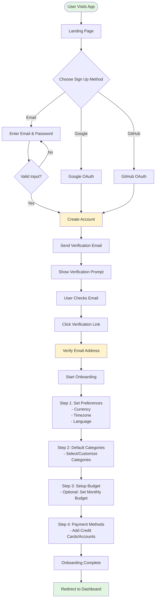
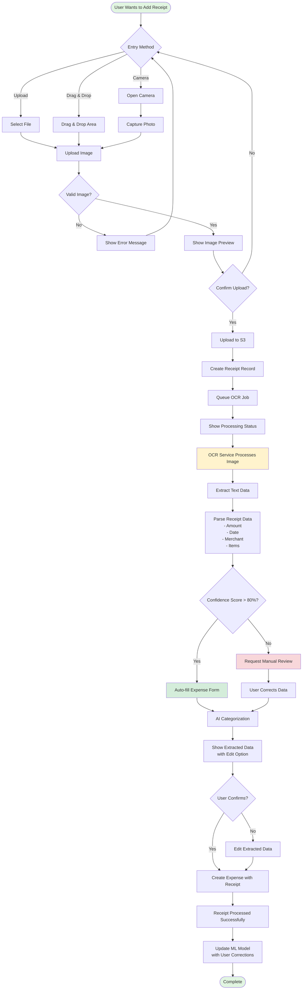
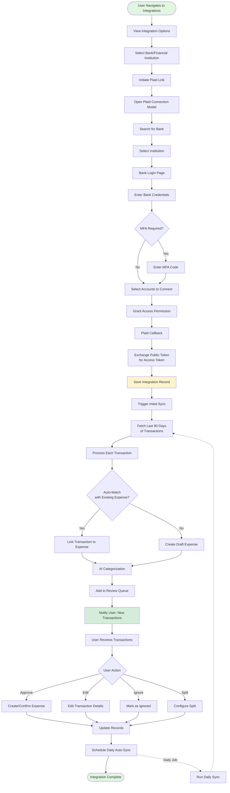
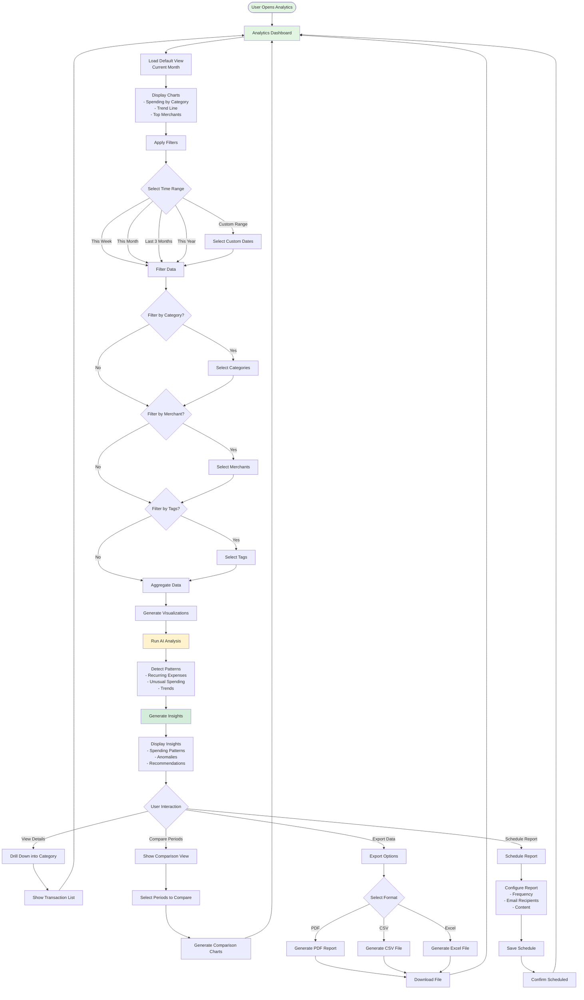
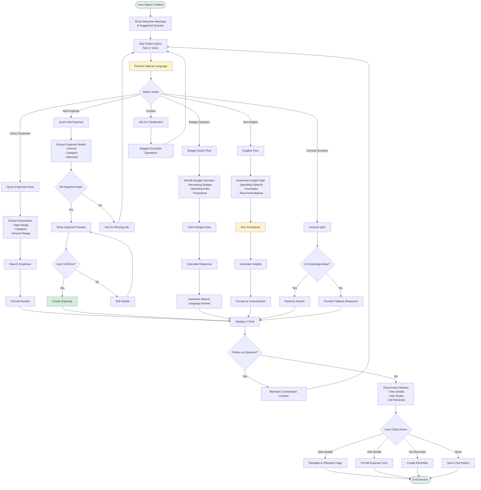
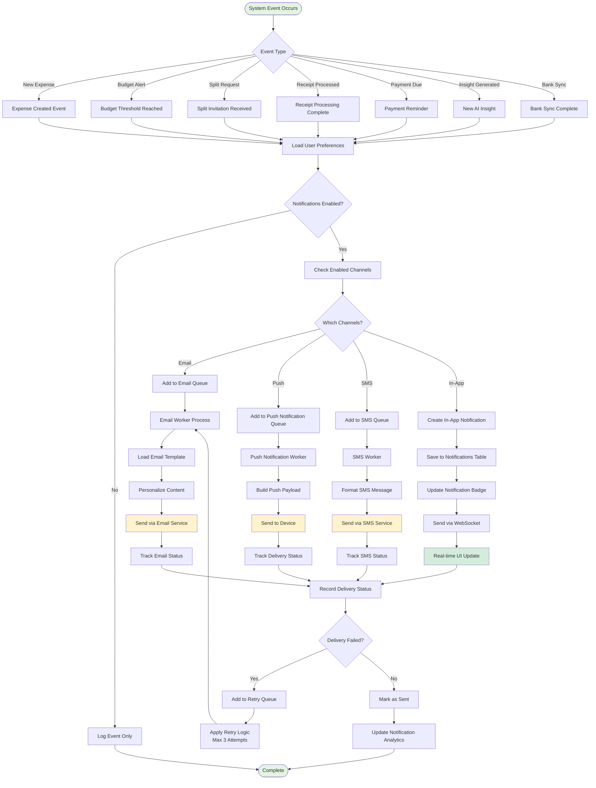
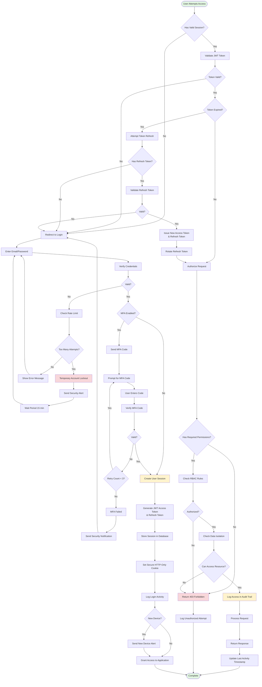

# User Flow Diagrams

## 1. User Registration & Onboarding Flow



## 2. Add Expense Flow (Manual Entry)

```mermaid
flowchart TD
    Start([User on Dashboard]) --> Click[Click "Add Expense"]
    Click --> Modal[Open Expense Modal]
    
    Modal --> Amount[Enter Amount]
    Amount --> Category[Select Category]
    Category --> AICheck{AI Suggestion Available?}
    
    AICheck -->|Yes| ShowSuggestion[Show AI Category Suggestion<br/>with Confidence Score]
    AICheck -->|No| Date
    
    ShowSuggestion --> AcceptAI{Accept Suggestion?}
    AcceptAI -->|Yes| Date
    AcceptAI -->|No| ManualCategory[Manually Select Category]
    ManualCategory --> Date
    
    Date[Select Date] --> Merchant[Enter Merchant Name]
    Merchant --> Description[Add Description Optional]
    Description --> Payment[Select Payment Method]
    Payment --> Tags[Add Tags Optional]
    Tags --> Receipt{Upload Receipt?}
    
    Receipt -->|Yes| UploadFile[Upload Receipt Image]
    Receipt -->|No| Split
    
    UploadFile --> ProcessReceipt[Process Receipt<br/>Background Job]
    UploadFile --> Split
    
    Split{Split Expense?}
    Split -->|Yes| SplitConfig[Configure Split<br/>- Select Users<br/>- Enter Amounts/Percentages]
    Split -->|No| Recurring
    
    SplitConfig --> Recurring{Recurring?}
    Recurring -->|Yes| RecurringConfig[Configure Recurrence<br/>- Frequency<br/>- End Date]
    Recurring -->|No| Review
    RecurringConfig --> Review
    
    Review[Review Expense Details] --> Submit[Submit Expense]
    Submit --> Save[Save to Database]
    Save --> Notify[Send Notifications]
    
    Notify --> UpdateBudget[Update Budget Tracking]
    UpdateBudget --> CheckBudget{Budget Threshold Exceeded?}
    
    CheckBudget -->|Yes| BudgetAlert[Send Budget Alert]
    CheckBudget -->|No| Success
    BudgetAlert --> Success
    
    Success[Show Success Message] --> Dashboard[Return to Dashboard]
    
    ProcessReceipt -.Background Process.-> ExtractData[Extract Data from Receipt]
    ExtractData -.-> UpdateExpense[Update Expense with Extracted Data]
    UpdateExpense -.-> NotifyUser[Notify User: Receipt Processed]
    
    style Start fill:#e1f5e1
    style Dashboard fill:#e1f5e1
    style Save fill:#fff3cd
    style BudgetAlert fill:#f8d7da
```

## 3. Receipt Scanning Flow



## 4. Budget Setup & Tracking Flow

```mermaid
flowchart TD
    Start([User Navigates to Budgets]) --> View[View Budget Dashboard]
    View --> Action{User Action}
    
    Action -->|Create New| CreateBudget[Click "Create Budget"]
    Action -->|Edit Existing| EditBudget[Select Budget to Edit]
    Action -->|View Progress| ViewProgress[View Budget Details]
    
    CreateBudget --> BudgetForm[Budget Creation Form]
    BudgetForm --> Name[Enter Budget Name]
    Name --> Category[Select Category<br/>or Overall Budget]
    Category --> Amount[Set Budget Amount]
    Amount --> Period[Choose Period<br/>- Weekly<br/>- Monthly<br/>- Quarterly<br/>- Yearly<br/>- Custom]
    Period --> DateRange[Set Date Range]
    DateRange --> Alerts[Configure Alerts<br/>- 50% threshold<br/>- 80% threshold<br/>- 100% exceeded]
    Alerts --> Rollover{Enable Rollover?}
    
    Rollover -->|Yes| RolloverConfig[Configure Rollover Rules]
    Rollover -->|No| Save
    RolloverConfig --> Save[Save Budget]
    
    Save --> Calculate[Calculate Current Spending]
    Calculate --> Display[Display Budget Progress]
    
    Display --> Monitor[Monitor Budget Status]
    Monitor --> CheckSpending{New Expense Added}
    
    CheckSpending --> UpdateProgress[Update Budget Progress]
    UpdateProgress --> CheckThreshold{Threshold Reached?}
    
    CheckThreshold -->|50%| Warning[Send Warning Notification]
    CheckThreshold -->|80%| Alert[Send Alert Notification]
    CheckThreshold -->|100%| Critical[Send Critical Alert]
    CheckThreshold -->|No| Continue
    
    Warning --> Continue[Continue Monitoring]
    Alert --> Continue
    Critical --> Suggest[Suggest Budget Adjustment<br/>or Spending Reduction]
    Suggest --> Continue
    
    Continue --> Monitor
    
    EditBudget --> BudgetForm
    
    ViewProgress --> Details[Show Detailed Breakdown<br/>- Total Spent<br/>- Remaining<br/>- Daily Average<br/>- Projected End]
    Details --> Insights[AI Insights<br/>- Spending Patterns<br/>- Recommendations]
    Insights --> Export{Export Report?}
    Export -->|Yes| GenerateReport[Generate Budget Report]
    Export -->|No| Done
    GenerateReport --> Done([Complete])
    
    style Start fill:#e1f5e1
    style Done fill:#e1f5e1
    style Save fill:#fff3cd
    style Critical fill:#f8d7da
    style Warning fill:#fff3cd
```

## 5. Bank Integration & Sync Flow



## 6. Analytics & Insights Flow



## 7. Expense Sharing & Splitting Flow

```mermaid
flowchart TD
    Start([User Has Expense to Split]) --> CreateExpense[Create/Select Expense]
    CreateExpense --> EnableSplit[Enable "Split Expense"]
    
    EnableSplit --> SplitMethod{Choose Split Method}
    
    SplitMethod -->|Equal Split| EqualSplit[Divide Equally Among Users]
    SplitMethod -->|Percentage| PercentageSplit[Assign Percentages]
    SplitMethod -->|Custom Amount| CustomAmount[Enter Custom Amounts]
    SplitMethod -->|By Item| ItemSplit[Split by Receipt Items]
    
    EqualSplit --> SelectUsers[Select Users to Split With]
    PercentageSplit --> SelectUsers
    CustomAmount --> SelectUsers
    ItemSplit --> AssignItems[Assign Items to Users]
    AssignItems --> SelectUsers
    
    SelectUsers --> Household{From Household?}
    Household -->|Yes| SelectMembers[Select Household Members]
    Household -->|No| EnterEmails[Enter Email Addresses]
    
    SelectMembers --> Calculate
    EnterEmails --> Calculate[Calculate Split Amounts]
    
    Calculate --> Review[Review Split Details<br/>- Each User's Share<br/>- Payment Status]
    Review --> AddNote[Add Note/Description Optional]
    AddNote --> Confirm{Confirm Split?}
    
    Confirm -->|No| SplitMethod
    Confirm -->|Yes| CreateSplit[Create Expense Splits]
    
    CreateSplit --> SaveExpense[Save Expense with Splits]
    SaveExpense --> SendInvitations[Send Split Invitations]
    
    SendInvitations --> NotifyUsers[Notify Each User<br/>- Email<br/>- Push Notification<br/>- In-App]
    
    NotifyUsers --> UserReceives[Users Receive Invitation]
    UserReceives --> UserAction{User Response}
    
    UserAction -->|Accept| AcceptSplit[Accept Split]
    UserAction -->|Reject| RejectSplit[Reject Split]
    UserAction -->|Request Change| RequestModification[Request Modification]
    
    AcceptSplit --> RecordAcceptance[Record Acceptance]
    RecordAcceptance --> PaymentStatus{Mark as Paid?}
    
    PaymentStatus -->|Yes| MarkPaid[Update Payment Status]
    PaymentStatus -->|No| PendingPayment[Keep Status as Pending]
    
    MarkPaid --> UpdateExpense
    PendingPayment --> SendReminder[Schedule Payment Reminder]
    SendReminder --> UpdateExpense
    
    RejectSplit --> NotifyCreator[Notify Expense Creator]
    NotifyCreator --> CreatorAction{Creator Response}
    CreatorAction -->|Modify| ModifySplit[Modify Split Details]
    CreatorAction -->|Remove User| RemoveFromSplit[Remove User from Split]
    ModifySplit --> SendInvitations
    RemoveFromSplit --> Recalculate[Recalculate Remaining Splits]
    Recalculate --> UpdateExpense
    
    RequestModification --> ReviewRequest[Creator Reviews Request]
    ReviewRequest --> ApproveChange{Approve Change?}
    ApproveChange -->|Yes| ModifySplit
    ApproveChange -->|No| DenyChange[Deny Modification]
    DenyChange --> NotifyRequester[Notify Requester]
    NotifyRequester --> UserReceives
    
    UpdateExpense[Update Expense Status] --> CheckComplete{All Users Paid?}
    CheckComplete -->|Yes| MarkComplete[Mark Expense as Settled]
    CheckComplete -->|No| TrackPayments[Continue Tracking Payments]
    
    MarkComplete --> SendConfirmation[Send Confirmation to All]
    TrackPayments --> MonitorStatus[Monitor Payment Status]
    MonitorStatus --> SendReminders[Send Periodic Reminders]
    
    SendConfirmation --> Done([Split Complete])
    SendReminders -.Periodic Check.-> CheckComplete
    
    style Start fill:#e1f5e1
    style Done fill:#e1f5e1
    style SaveExpense fill:#fff3cd
    style MarkComplete fill:#d4edda
```

## 8. AI Chatbot Interaction Flow



## 9. Notification System Flow



## 10. Security & Authentication Flow



---

## User Journey Summary

### New User Journey
1. **Discovery** → Landing page with features
2. **Sign Up** → Quick registration (email/OAuth)
3. **Onboarding** → Setup preferences and first budget
4. **First Expense** → Add expense manually or scan receipt
5. **Exploration** → Discover features (analytics, budgets, AI)
6. **Engagement** → Regular expense tracking
7. **Retention** → Insights, notifications, value realization

### Power User Journey
1. **Bulk Import** → Connect bank accounts
2. **Automation** → Set up recurring expenses
3. **Collaboration** → Create household, invite members
4. **Advanced Analytics** → Custom reports, export data
5. **Integration** → Connect to accounting software
6. **Optimization** → Use AI insights for savings

### Mobile User Journey
1. **Quick Capture** → Scan receipt on the go
2. **Voice Entry** → Add expense via voice
3. **Push Notifications** → Stay updated on budgets
4. **Widget Access** → Quick view of spending
5. **Offline Mode** → Queue actions for sync

---

These flows cover the main user interactions and provide a clear understanding of how users will navigate through the application.
